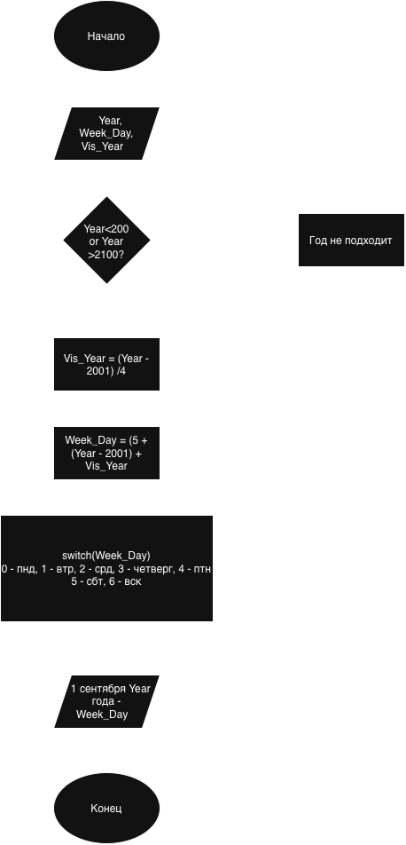

Домашнее задание к работе 7. Задание номер 8. Определить на какой день недели приходится 1 сентября произвольно
заданного года XXI века.
1. Алгоритм и блок схема:
     1. Начало.
     2. Обьявить переменную Year, Week_Day. Vis_year.
     3. Ввод данных Year.
     4. Проверка: год в 21 веке?
     5. Проверка: сколько високосных годов было до этого.
     6. Считаем день недели.
     7. Через оператор Switch выводим день недели.
     8. Конец.

   Блок-схема:

   

3. Реализация программы
4. Результаты работы программы: Введите год
2026
День недели 2026 года 1 сентября: 
Вторник
5. Информация о разработчике: Гуров Е.А. бОТИ-261 1п/г
